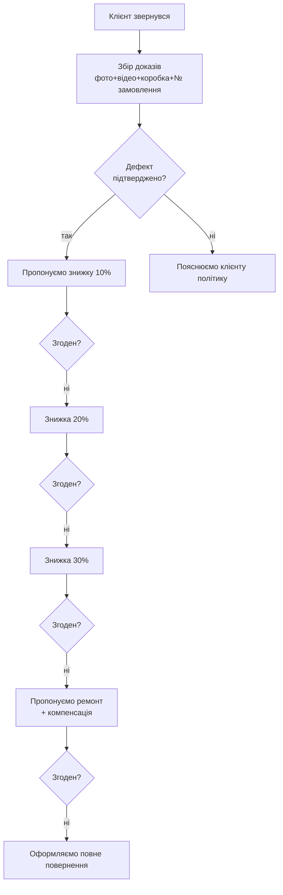

<!-- type: sop -->
# Алгоритм роботи з поверненнями

> **Власник процесу:** Відділ продажів *(потребує уточнення — відповідальна особа)*
> **Для кого:** Менеджери з продажу, бухгалтерія, склад
> **Оновлено:** 2026-05-28
> **Статус:** Актуально
> **Теги:** #повернення #брак #ротація #waldi #1с #легке_повернення

## 🎯 Мета

Швидко й чесно опрацювати повернення клієнта так, щоб партнер залишився задоволеним, Selfy зберіг маржу через знижку чи ремонт замість повного повернення, а бракований товар повернувся для розслідування з постачальником.

## 👤 Для кого

- **Менеджери з продажу** — основні виконавці процесу
- **Бухгалтерія** — оформлення повернення коштів
- **Склад** — приймання, огляд, передача рішення

## 🧭 Коротко

1. Клієнт пише → менеджер просить **фото + відео + фото коробки** + номер замовлення.
2. Аналіз: брак (Selfy винна) чи ротація (клієнт винен).
3. Якщо брак — пропонуємо в порядку: **знижка 10-30% → ремонт за рахунок Selfy → повне повернення**.
4. Повернення оформляємо через «Легке повернення» НП до 3 днів від звернення.
5. Кошти — тільки після огляду на складі (1-3 дні).

## 🧩 Терміни

- **Брак** — заводський дефект товару
- **Розпаровка** — у коробці взуття різних розмірів або обидва на одну ногу
- **Пересорт** — не той колір/розмір/модель (помилка нашого складу)
- **Ротація** — плановий обмін якісного товару що "не пішов" (за рахунок клієнта)
- **Легке повернення** — сервіс Нової Пошти в додатку (часто безкоштовно до 30 кг)
- **ТТН** — товарно-транспортна накладна (номер посилки НП)

## ✅ Алгоритм роботи з браком

### Крок 1. Збір доказів *(ОБОВ'ЯЗКОВО)*

- [ ] Фото дефекту (3+ ракурси, добре освітлення)
- [ ] Відео дефекту (показати рух/функціонування)
- [ ] Фото коробки з артикулом і штрих-кодом
- [ ] Номер замовлення в Selfy

:::warning
Без доказів розгляд НЕ починаємо. Це принципово.
:::

### Крок 2. Воронка рішень

Рухаємось **від найменшої знижки до більшої**: 10% → 20% → 30% → ремонт → повне повернення.

Менеджер приймає рішення САМ у межах **10-30%**. Більше — через керівника.

### Крок 3. Оформлення повернення

Якщо клієнт відмовляється від знижки/ремонту:

- [ ] Заповнити файл **«Повернення товару»** в 1С
- [ ] Узгодити з клієнтом термін відправки **до 3 днів** через «Легке повернення» НП
- [ ] У коментарі ТТН: **«Брак»** або **«Обмін»**
- [ ] Отримати ТТН від клієнта і передати на склад

:::warning
Якщо склад не знає номер ТТН — посилка приходить як невпізнана і "губиться".
:::

## 💰 Хто платить за доставку повернення

| Причина | Платить |
|---|---|
| Заводський брак | **Selfy** *(Легке повернення безкоштовно до 30 кг)* |
| Розпаровка | **Selfy** |
| Пересорт | **Selfy** |
| Помилка складу | **Selfy** |
| Товар на огляд | **Selfy** |
| Ротація («не пішло») | **Клієнт** |
| Помилка клієнта при замовленні | **Клієнт** |
| Обмін моделі | **Клієнт** |

## ⏱ Терміни

| Дія | Термін |
|---|---|
| Клієнт повідомляє про проблему | До **5 днів** після отримання |
| Узгодження → відправка | До **3 днів** від звернення |
| Огляд на нашому складі | **1-3 робочі дні** |
| Повернення коштів | **1-3 робочі дні** після огляду |

:::info
Після 14 днів — рішення індивідуальне. Постійним партнерам менеджер може погодити через керівника.
:::

## 💵 Повернення коштів

Тільки **після фізичного огляду** на складі.

**Варіанти:**
- **У взаєморозрахунки** — якщо в клієнта є відтермінування
- **На рахунок клієнту** — повний переказ

:::warning
НЕ повертаємо кошти "за фото ТТН". Тільки після огляду.
:::

## 📌 Спеціальні правила (бренди)

### Waldi
- Розпаровки і браки **ЗАВЖДИ повертаються на наш склад**
- Це наш стратегічний бренд — пріоритет розгляду

### Інші бренди взуття
- Розпаровки → фото в чат Telegram **«Браки/Розпаровки взуття»**
- Далі за стандартним алгоритмом

### FreeON / Velano
- Selfy офіційний дистриб'ютор / власна ТМ — рішення зазвичай швидші

### Tega Baby
- Стандартний алгоритм
- Дропшипінг по Tega Baby не працює — повернення тільки з гуртових партій

## ⚠️ Типові помилки

1. **Старт без фото/відео** — не вдасться ні знижку погодити, ні повернення провести
2. **Пропонувати одразу 30%** — завжди стартуй з 10%
3. **Прийняти повернення поза алгоритмом** — товар буде переданий менеджеру і оплачений менеджером
4. **Не повідомити склад про ТТН клієнта** — посилка зайде як невпізнана
5. **Обіцяти повернути кошти "одразу за ТТН"** — тільки після огляду
6. **Прийняти ротацію зимового в березні** — сезонне НЕ приймаємо в кінці сезону
7. **Прийняти ротацію з пошкодженою коробкою / слідами носіння** — тільки в ідеальному стані

## ☑️ Чек-лист закриття повернення

- [ ] Отримав фото + відео + фото коробки + номер замовлення
- [ ] Пройшов воронку: знижка → ремонт → повернення
- [ ] Заповнив файл «Повернення товару» в 1С
- [ ] Узгодив термін відправки з клієнтом (до 3 днів)
- [ ] Отримав ТТН від клієнта і передав на склад
- [ ] Дочекався огляду товару
- [ ] Оформив повернення коштів
- [ ] Сповістив клієнта про закриття

## 🆘 Якщо щось пішло не так

| Ситуація | Дія |
|---|---|
| Клієнт відмовляється давати фото/відео | Відмова в розгляді + пояснення політики |
| Клієнт вимагає знижку 50%+ | Консультація з керівником |
| Товар на складі без ТТН у списку | Кладемо в «загубилось» → пошук вручну |
| Товар прийшов з прихованим дефектом | Фото на склад → керівник |
| Затримка повернення коштів — скарга | Перевірити статус огляду → дати дату |
| Постійний партнер просить ротацію після сезону | Через керівника |

## 📝 Шаблони повідомлень

**Запит доказів:**
> Добрий день! Щоб ми могли швидко розглянути проблему, надішліть, будь ласка: 1) фото дефекту з кількох ракурсів, 2) коротке відео як проявляється, 3) фото коробки з артикулом, 4) номер замовлення. Як отримаємо — повернусь з рішенням протягом дня.

**Пропозиція знижки:**
> Перевірив фото. Це справді виробничий дефект. Пропоную комерційну уцінку 10%, щоб ви могли продати товар з мінімальною знижкою у себе, не відправляючи назад. Підходить?

**Пропозиція ремонту:**
> Дефект незначний і виправляється локально (наприклад, заміна бігунка). Ми компенсуємо вам вартість ремонту — приблизно {сума}. Такий варіант підходить?

**Узгодження повернення:**
> Окей, оформлюємо повне повернення. Відправте товар через «Легке повернення» в додатку НП (до 30 кг безкоштовно). У коментарі — «Брак». ТТН перешліть мені — передам на склад. Термін відправки — до {дата+3 дні}.

**Закриття:**
> Товар отримали і оглянули. Кошти зараховую у взаєморозрахунки {сума} / повертаю на рахунок до {дата}. Питання — пишіть!

## ⚠️ Потрібно уточнити

- [ ] Власник процесу — відповідальна особа
- [ ] Пріоритет повернень після Waldi і «повних ростовок сезонного взуття» — частина переліку відсутня в оригінальному тексті
- [ ] Чи може менеджер погоджувати знижку **більше 30%** з керівником, або це жорсткий ліміт?
- [ ] Як діяти при ЗМІШАНОМУ поверненні (брак + ротація разом) — одна ТТН чи окремі?
- [ ] Сума компенсації ремонту — є табличка/орієнтир?

## 📎 Пов'язані документи

- [[Взаємодія менеджера з бухгалтерією: оплати, договори, повернення]]
- [[Скрипт продажу стійки Waldi]]
- [[Файл "Повернення товару" в 1С — інструкція]] *(якщо існує)*
- [[Друга розмова: клієнт ознайомився - заперечення]]
