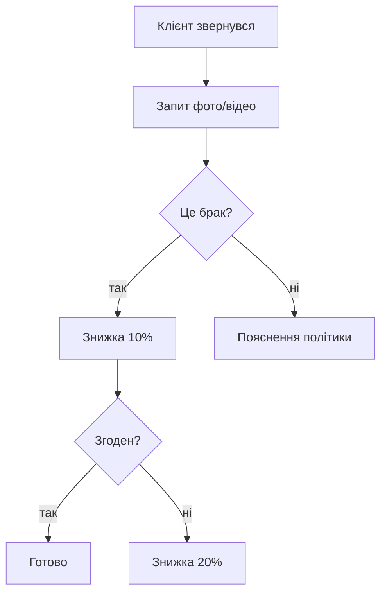

# Outline 1.8 — повний довідник можливостей

Цей файл — пам'ятка для редактора скіла. Використовуй ВСЕ що може Outline, щоб документи не виглядали як "плоский markdown".

## 1. Контент-блоки

### 1.1 Текстове форматування

| Що | Markdown | Коли |
|---|---|---|
| Заголовки | `# H1`, `## H2`, `### H3` | H1 = назва документа. H2 = розділи. H3 = підрозділи. H4+ НЕ показується в TOC — уникай. |
| Жирний | `**bold**` | Для ключових термінів, важливих фактів |
| Курсив | `*italic*` | Для назв документів, термінів, цитат |
| Закреслений | `~~strike~~` | Для застарілих варіантів |
| Highlight | `==highlight==` | Для виділення кольором (з 01.2026) |
| Inline code | `` `code` `` | Для команд, артикулів, файлових імен |
| Inline math | `$x=y$` | LaTeX inline |

### 1.2 Списки

```markdown
- Bullet
* Bullet (теж працює)
1. Numbered
- [ ] TODO checkbox
- [x] DONE checkbox
```

⚠️ Після оновлення (1.7+) — можна toggle сховати/показати completed.

### 1.3 Цитати

```markdown
> Цитата

> **Готова фраза для скрипта продажу:**
> "Добрий день! Це [Ім'я] з компанії Selfy..."
```

### 1.4 Дивайдер

```markdown
---
```

Розділяє великі секції.

### 1.5 Code blocks

````markdown
```bash
docker compose up -d
```

```sql
SELECT * FROM orders WHERE status='pending';
```
````

Завжди вказуй мову для syntax highlight.

### 1.6 Mermaid діаграми ⭐

Найкорисніша фіча для алгоритмів:

````markdown

````

Підтримувані типи: `flowchart`, `sequence`, `gantt`, `ER`, `stateDiagram`, `mindmap`.

### 1.7 Math (KaTeX)

```markdown
$$
\text{Маржа} = \frac{\text{Продажна ціна} - \text{Закупівельна ціна}}{\text{Продажна ціна}}
$$
```

### 1.8 Notice blocks (callouts) ⭐⭐⭐

Чотири типи — використовуй активно:

```markdown
:::info
Інформаційний блок (синій). Для довідкової інформації.
:::

:::success
Успішне завершення (зелений). Для позитивних кейсів і чек-листів.
:::

:::tip
Корисна порада (фіолетовий). Для хитрощів і best practices.
:::

:::warning
Попередження (жовтий/червоний). Для важливого, що НЕ можна пропустити.
:::
```

**Приклади Selfy:**

```markdown
:::warning
Зимове взуття НЕ приймаємо в ротацію після 1 березня. Виключень не робимо.
:::

:::info
Безкоштовна доставка по Waldi — від 25 000 грн на відділення.
:::

:::tip
Завжди стартуй з 10% знижки, а не одразу з 30%. Економить маржу.
:::

:::success
Алгоритм виконано правильно якщо: клієнт задоволений, маржа збережена, товар повернувся (якщо брак).
:::
```

### 1.9 Toggle blocks ⭐ (Outline 1.7+)

Згортувані секції — рятують від перевантаження:

```markdown
/toggle Розгорнути для деталей
Тут довгий зміст який не хочеться завжди показувати.
- Деталь 1
- Деталь 2
- Деталь 3
```

Використовуй для:
- FAQ відповідей (питання видно, відповідь прихована)
- Edge cases
- Технічних деталей реалізації
- Прикладів коду

### 1.10 Таблиці ⭐⭐

Створюй через markdown:

```markdown
| Колонка 1 | Колонка 2 | Колонка 3 |
|---|---|---|
| Дані | Дані | Дані |
```

Outline 1.7+ підтримує:
- Sort колонок
- Reorder колонок/рядків
- Кольорування клітинок
- Merge cells
- Списки всередині клітинок

**Коли таблиці незамінні:**
- "Хто платить за повернення" (причина → платник)
- Терміни (дія → дедлайн)
- Порівняння брендів / тарифів
- Якщо X → то Y (умова → дія)

### 1.11 Media

```markdown

```

Outline підтримує:
- JPG/PNG/GIF (retina, drag&drop)
- Видео (uploaded без re-encode)
- PDF inline (1.7+)
- Draw.io діаграми (1.7+)

### 1.12 Embeds

Вставляй URL — Outline сам відрендерить:

- YouTube → плеєр
- Loom → плеєр
- Figma → frame
- Google Docs/Sheets → preview
- GitHub/GitLab/Linear → rich mention з статусом
- Spotify, X/Twitter, Miro

### 1.13 Document mentions / Backlinks ⭐⭐⭐

ЗАМІСТЬ markdown links на інші документи — використовуй mention:

```markdown
[[Алгоритм роботи з поверненнями]]
[[Скрипт продажу стійки Waldi]]
```

Чому це краще:
- Outline створює живий backlink (видно знизу обох документів)
- При перейменуванні документа посилання не ламається
- Граф знань будується автоматично

## 2. Навігація

### 2.1 Auto-TOC ⭐

Outline ЗАВЖДИ показує TOC збоку з H2/H3.

**ВИСНОВОК:**
- ❌ Не пиши секцію "Зміст" у тілі
- ✅ Робіть чіткі H2 / H3 (не пропускай рівні)
- ❌ H4+ не показується в TOC — для важливого використовуй H3

### 2.2 Slug

URL генерується автоматично: `/doc/назва-документа-XXXX`. Вручну не задається.

### 2.3 Collections (колекції)

Для Selfy уже є:
- Головний
- Інструкції
- Відділ продажу
- Скрипти
- Навчання
- IT та Інструкції
- Про компанію
- Архів
- China / Velano Sourcing
- Benext

Вкладеність документів — до 3 рівнів (більше = складно для пошуку).

## 3. Спільна робота

| Фіча | Використання |
|---|---|
| Comments | Інлайн коментарі на тексті/коді/картинках |
| Reactions | 👍 / ❤️ / 🚀 на документи і коментарі |
| Mentions | `@юзер` — нотифікація |
| Group mentions | `@група` (1.7+) — всім учасникам |
| Edit history | Revisions з diff view, revert |
| Subscriptions | Документ або колекцію — отримуєш оновлення |

## 4. Templates

Створюються через Settings → Templates. Підтримують:
- Placeholders (виділиш текст → "Convert to placeholder")
- Variables: `{datetime}`, `{author}`

При створенні нового документа є кнопка "Templates" — обираєш шаблон.

**Для Selfy** — створимо вбудовані шаблони в Outline за нашими `templates/` файлами.

## 5. Search

- Full-text по всьому
- Фільтри: Collection, Author, Date, Status
- Cmd+F всередині документа
- Outline враховує popularity, recency, title match

## 6. API (для нашого refactor-боту)

| Endpoint | Призначення |
|---|---|
| `POST /documents.create` | Створити документ (`publish: false` = чернетка) |
| `POST /documents.update` | Оновити (з `append: true` — додати) |
| `POST /documents.info` | Отримати документ |
| `POST /documents.search` | Шукати по базі |
| `POST /documents.list` | Список по фільтрах |
| `POST /collections.list` | Список колекцій |

**Markdown повністю сумісний з API** — `text` поле приймає всі notice/mermaid/toggle блоки.

## 7. Що НЕ підтримує Outline

❌ Tags / labels (тільки collections + nesting)
❌ Database / properties (як Notion)
❌ Kanban / board views
❌ Columns (мульти-колонковий layout)
❌ Default template на колекцію (тільки вручну)
❌ Custom CSS
❌ Slug вручну

## 8. Рекомендації для Selfy документів

✅ **Активно**:
- Notice blocks (всі 4 типи)
- Mermaid для алгоритмів
- Таблиці для порівнянь
- Document mentions (`[[]]`)
- Чек-боксы для процедур
- Toggle для деталей які не для всіх

⚠️ **Помірно**:
- Embeds (тільки для ключових YouTube/Loom)
- Code blocks (тільки де є реальний код/команди)
- Math (рідко)

❌ **Уникати**:
- H4+ для важливих секцій
- Сирих URL замість document mentions
- Емодзі-перевантаження (1 на H2 max)
- Великих таблиць (краще розбити)
- Зміст у тілі документа
