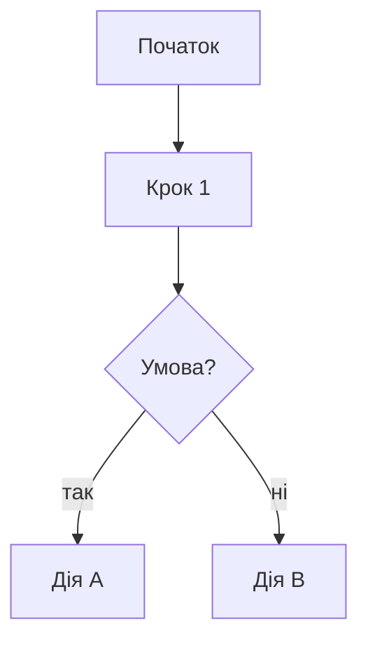

<!-- type: sop -->
# {Назва процесу}

- **Власник процесу:** {ПІБ / роль}
- **Для кого:** {відділ / ролі}
- **Оновлено:** {YYYY-MM-DD}
- **Статус:** Актуально
- **Теги:** #{тег1} #{тег2} #{тег3}

## 🎯 Мета

{2-3 речення: навіщо існує цей процес, який результат досягаємо}

## 👤 Для кого

{Конкретні ролі / відділи, які виконують цей процес}

## 🧭 Коротко

{3-5 пунктів — найголовніше для швидкого ознайомлення}

1. ...
2. ...
3. ...

## 🧩 Терміни

{Якщо в документі використовуються спеціальні терміни Selfy — поясни їх}

- **Термін 1** — пояснення
- **Термін 2** — пояснення

## ✅ Алгоритм

{Mermaid діаграма для складних процесів}

### Крок 1. {Назва}
{Опис, обов'язкові пункти у вигляді чек-листа}

- [ ] Підкрок 1
- [ ] Підкрок 2

### Крок 2. {Назва}
{...}

## 📌 Правила і політики

{Жорсткі правила які потрібно дотримуватись}

:::warning
{Найважливіше правило}
:::

- Правило 1
- Правило 2

## 🧰 Інструменти / Доступи

{Що потрібно для виконання процесу}

| Інструмент | Доступ | Де знайти |
|---|---|---|
| 1С | Робочий профіль | ... |

## 🧪 Приклади / Кейси

{1-3 реальні приклади як це виглядає}

**Кейс 1: ...**
{Опис ситуації + як вирішено}

## ⚠️ Типові помилки

1. **{Помилка}** — {чому це помилка + як уникнути}
2. ...

## 🔎 Як перевірити що все ок

- [ ] {Критерій 1}
- [ ] {Критерій 2}
- [ ] {Критерій 3}

## 🆘 Якщо щось пішло не так

| Ситуація | Дія |
|---|---|
| {Проблема 1} | {Що робити} |
| {Проблема 2} | {Що робити} |

## 📝 Шаблони / Заготовки

{Готові фрази, шаблони повідомлень, заголовки документів}

## ⚠️ Потрібно уточнити

{Список питань що не з'ясовані у вхідному тексті}

- [ ] {Що уточнити}

## 📎 Пов'язані документи

- [[Назва документа 1]]
- [[Назва документа 2]]
